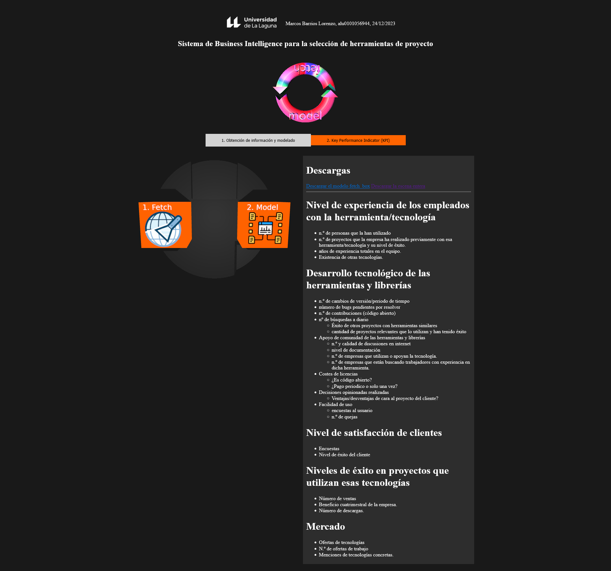

# Landing page for *Gestión de comunicación y conocimiento empresarial* subject's project using ThreeJS and Gatsby.

This is part of *Sistemas y Tecnologías Web: Cliente* subject's `ThreeJS` assignment. The requirements are:

  - Create a few ThreeJS scenes and them on different places.
  - Have selectable 3D models in the scenes, which trigger information changes on the webpage. Be able to download the models.
  - Use light and shadows casted to a floor.
  - Have an animated 3D Model on at least one scene.
  - Make a report explaining the technical aspects and functionality. It is also asked for it to be in english language.

## Installation

Edit: **Currently broken for an unknown reason** It does not serve.

To serve use:

`npm run install`

And

`npm run build`

And finally:

`npm run serve`

## Screenshot of webpage

